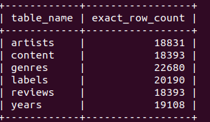

# Ingestion and Disaster Recovery with DMS

## Pre-Lab

To setup the lab environment, run

```
cd terraform
terraform apply
```

This should setup the resources for your lab.

## Lab Instructions

### View the Source and Destination Databases

Procedure: From the AWS Management Console, complete the following steps:

1. From the Services list, select **RDS** under Database.
2. Click **DB Instances**.
3. Click the DB instances with the identifier **dms-lab-db**.
4. Take note of the **Endpoint**. It should be similar to the following: `demo-dev-db.cnvkubjxuz6y.us-west-2.rds.amazonaws.com`
5. From the Services list back at the top, select **EC2**.
6. Click **Instances (running)**.
7. Select the instance labeled **DMS-Lab-SourceDb** and take note of the **Private IPv4 addresses**.
8. You should see two instances running. Select the instance named **DMS-Lab-BastionInstance**.
9. Click **Connect**.
10. Select the **Session Manager** heading, then click **Connect**.
11. A new tab should open with a shell prompt. Run the following command into the shell: `mysql -u mysqladmin -h <private ip> -pPassword1 pitchfork`. Replace `<private ip>` with the IP address you took note of in step 7. This should open a MySQL shell and allow you to run database queries.
12. Run the desired command on the MySQL shell.

```sql
SELECT "artists" AS table_name, COUNT(*) AS exact_row_count FROM pitchfork.artists UNION

SELECT "content" AS table_name, COUNT(*) AS exact_row_count FROM pitchfork.content UNION

SELECT "genres" AS table_name, COUNT(*) AS exact_row_count FROM pitchfork.genres UNION

SELECT "labels" AS table_name, COUNT(*) AS exact_row_count FROM pitchfork.labels UNION

SELECT "reviews" AS table_name, COUNT(*) AS exact_row_count FROM pitchfork.reviews UNION

SELECT "years" AS table_name, COUNT(*) AS exact_row_count FROM pitchfork.years;
```

You should see the number of rows in each table in the database. The output should be similar to the following.



13. Press `CTRL+D` to exit the MySQL console.
14. Run the following command into the shell: `mysql -u mysqladmin -h <rds host> -pPassword1`. Replace <rds host> with the endpoint you took note of in step 4.
15. Type and run `show databases;`

Note that the only databases present are the defaults. There is no pitchfork database. Throughout the rest of the lab, you will use DMS to transfer the data from the source instance into RDS. Be sure to note down the IP address of the source instance, as you will need it in the next challenge

### Create the Replication Instance

1. In the AWS Management Console, on the **Services** menu, click **Database Migration Service** under Migration & Transfer.
2. In the left navigation pane, click **Subnet groups** under Resource management.
3. Click Create subnet group then configure:
   - Identifier: `MS-SubnetGroup`
   - Description: `My replication subnet group`
   - VPC: **DMS-Lab-Vpc**
   - In the **Add subnets** section, select **DMS-Lab-PrivateSubnet1**, **DMS-Lab-PrivateSubnet2**, and **DMS-Lab-PrivateSubnet3**.
4. Click **Create subnet group**. This subnet group is where your replication instance will reside.
5. In the left navigation pane, click Replication instances under Resource management.
6. Click Create replication instance then configure:
   - Name: `DMS-Instance`
   - Description: `Replication instance for migrating to Amazon RDS`
   - VPC: **DMS-Lab-Vpc**
   - Ensure **Publicly accessible** is not selected. This is because the migration instance is within your VPC. If you were migrating outside of your VPC without a VPN, then this must be selected.
7. Expand the **Advanced security and network configuration** section.
8. Under **VPC security group(s)**, select the **DMS-Lab-RepInstance-Sg**.
9. Click **Create**. 
    
    - Wait until the replication Status displays **Available** before proceeding to the next step. It may take 5-10 minutes for the instance creation to complete. Click the **refresh** button to view any updates.

### Create the Migration Endpoints

1. In the left navigation pane, click **Endpoints** under Resource management.
2. Click **Create endpoint** then configure:
   - Endpoint type: **Source endpoint**
   - Endpoint identifier: `ec2mysqlendpoint`
   - Source engine: `mysql`
   - Server name: Paste the IP address of the **DMS-Lab-SourceDb** that you noted from the first challenge.
   - Port: `3306`
   - SSL Mode: `none`
   - User name: `mysqladmin`
   - Password: `Password1`
3. Expand the **Test endpoint connection** section.
4. Select **DMS-Lab-Vpc** as the VPC.
5. Click **Run test** and wait for the test to complete. This may take a few seconds.
6. At the bottom of the screen, click **Create endpoint**.
7. In the left navigation pane, click **Endpoints**.
8. Click **Create endpoint** then configure:
   - Endpoint type: **Target Endpoint**
   - Endpoint identifier: `rdsendpoint`
   - Tick **Select RDS DB Instance**
   - RDS Instance: Select **dms-lab-db**.
   - Password: `Password1`
9. Expand the **Test endpoint connection** section.
10. Select **DMS-Lab-Vpc** as the VPC.
11. Click **Run test** and wait for the test to complete. This may take a few seconds.
12. At the bottom of the screen, click **Create endpoint**.

### Create the Replication Job

1. In the left navigation pane, click **Data migration tasks** under Migration.
2. Click **Create task** then configure:
   - Task identifier: `RDS-Migration`
   - Replication instance: Select **dms-instance**.
   - Source database endpoint: `ec2mysqlendpoint`
   - Target database endpoint: `rdsendpoint`
3. In the Table mappings section, click Add new selection rule then configure:
   - Schema: select **Enter a schema**
   - Schema name: `pitchfork`
4. Click **Create task**.
5. Wait until the task completes. The task is complete when it displays a **Load Complete** status.

### Validate the Database Migration

1. From the Services list, select **EC2**.
2. Click **Instances (running)Running instances**.
3. You should see two instances running. Select the instance named **DMS-Lab-BastionInstance**.
4. Click **Connect**.
5. Select the **Session Manager** heading, then click **Connect**.
6. A new tab should open with a shell prompt. Run the following command into the shell: `mysql -u mysqladmin -h <rds host> -pPassword1 pitchfork`. Replace <rds host> with the endpoint you took note of in Challenge 1.
7. Run the following command on the MySQL shell.
```sql
SELECT "artists" AS table_name, COUNT(*) AS exact_row_count FROM pitchfork.artists UNION

SELECT "content" AS table_name, COUNT(*) AS exact_row_count FROM pitchfork.content UNION

SELECT "genres" AS table_name, COUNT(*) AS exact_row_count FROM pitchfork.genres UNION

SELECT "labels" AS table_name, COUNT(*) AS exact_row_count FROM pitchfork.labels UNION

SELECT "reviews" AS table_name, COUNT(*) AS exact_row_count FROM pitchfork.reviews UNION

SELECT "years" AS table_name, COUNT(*) AS exact_row_count FROM pitchfork.years;
```
You should see that the data has migrated successfully.